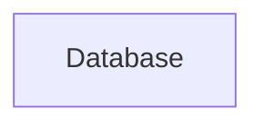

# Food Delivery Application
==========================

## Project Title
The Food Delivery Application is a comprehensive web-based platform designed to facilitate food ordering and delivery services. The application aims to provide a seamless user experience, enabling customers to browse and order food from various restaurants, while also offering restaurants a platform to manage their menus, orders, and deliveries.

## Project Description
The Food Delivery Application is built using a combination of front-end and back-end technologies, including JavaScript, React, Node.js, and Express.js. The application features a user-friendly interface, allowing customers to search for restaurants, view menus, place orders, and track the status of their deliveries. Restaurants can manage their menus, receive orders, and update the status of deliveries in real-time.

## Features
The following features are included in the Food Delivery Application:

* User registration and login functionality
* Restaurant registration and management
* Menu management for restaurants
* Order placement and management for customers
* Real-time order tracking and updates
* Payment gateway integration
* Rating and review system for restaurants and food items

## Tech Stack
The Food Delivery Application is built using the following technologies:

* Front-end: JavaScript, React
* Back-end: Node.js, Express.js
* Database: MongoDB
* Payment Gateway: Stripe
* APIs: RESTful APIs for data exchange between front-end and back-end

## Architecture Overview
The Food Delivery Application follows a microservices architecture, with separate services for user management, restaurant management, order management, and payment processing. The application uses a RESTful API to exchange data between services, ensuring loose coupling and scalability.

## Installation Guide
To install the Food Delivery Application, follow these steps:

1. Clone the repository using `git clone https://github.com/username/repository.git`
2. Navigate to the project directory using `cd project-directory`
3. Install dependencies using `npm install`
4. Start the application using `npm start`

## Usage Instructions
To use the Food Delivery Application, follow these steps:

1. Register as a user or restaurant by clicking on the "Register" button
2. Login to the application using your credentials
3. Browse restaurants and menus, and place orders as a customer
4. Manage menus, receive orders, and update delivery status as a restaurant

## API Overview
The Food Delivery Application exposes the following APIs:

* User API: `GET /users`, `POST /users`, `GET /users/:id`
* Restaurant API: `GET /restaurants`, `POST /restaurants`, `GET /restaurants/:id`
* Order API: `GET /orders`, `POST /orders`, `GET /orders/:id`
* Payment API: `POST /payments`

## Folder Structure
The Food Delivery Application follows the following folder structure:

* `Backend`: contains server-side code, including routes, models, and controllers
* `Frontend`: contains client-side code, including React components and CSS styles
* `config`: contains configuration files, including database and payment gateway settings
* `models`: contains database schema definitions
* `routes`: contains API route definitions
* `services`: contains business logic for order management and payment processing

## Deployment Instructions
To deploy the Food Delivery Application, follow these steps:

1. Create a production-ready build using `npm run build`
2. Deploy the application to a cloud platform, such as Vercel or Heroku
3. Configure environment variables, including database and payment gateway settings
4. Start the application using `npm start`

## Future Improvements
The following features are planned for future development:

* Integration with third-party delivery services
* Implementation of a rating and review system for delivery personnel
* Development of a mobile application for customers and restaurants

## Contributing
To contribute to the Food Delivery Application, follow these steps:

1. Fork the repository using `git fork https://github.com/username/repository.git`
2. Create a new branch using `git branch feature/feature-name`
3. Make changes and commit using `git commit -m "feature: feature-name"`
4. Open a pull request using `git pull-request`

## License
The Food Delivery Application is licensed under the MIT License. See `LICENSE` for details.

### Code of Conduct
The Food Delivery Application follows the [Contributor Covenant Code of Conduct](https://www.contributor-covenant.org/version/2/1/code_of_conduct/). See `CODE_OF_CONDUCT.md` for details. 

### Reporting Issues
To report issues or bugs, please contact the project maintainer at [santraakash999@gmail.com](mailto:santraakash999@gmail.com). All complaints will be reviewed and investigated promptly and fairly.

# Architecture Diagram

