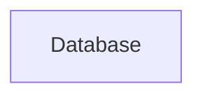

# Food Delivery Application
========================
## Project Description
The Food Delivery Application is a comprehensive platform designed to facilitate food ordering and delivery services. This application aims to provide a seamless experience for users to browse, order, and receive their favorite food items from various restaurants and shops.

## Features
* User authentication and authorization
* Restaurant and shop management
* Food item management
* Order management
* Real-time updates using Socket.IO
* Recommendation system

## Tech Stack
* Frontend: JavaScript, React
* Backend: Node.js, Express.js
* Database: MongoDB
* APIs: RESTful APIs

## Architecture Overview
```mermaid
graph LR
    A[Client] -->|HTTP Request|> B[Load Balancer]
    B -->|HTTP Request|> C[Server]
    C -->|Database Query|> D[Database]
    D -->|Data|> C
    C -->|HTTP Response|> B
    B -->|HTTP Response|> A
    C -->|Socket.IO|> A
```
The architecture of the Food Delivery Application consists of a client-side application built using React, a server-side application built using Node.js and Express.js, and a database built using MongoDB. The client and server communicate using RESTful APIs, and real-time updates are facilitated using Socket.IO.

## Installation Guide
To install the application, follow these steps:
1. Clone the repository using `git clone https://github.com/username/repository.git`
2. Navigate to the backend directory using `cd Backend`
3. Install dependencies using `npm install`
4. Start the server using `npm start`
5. Navigate to the frontend directory using `cd Frontend`
6. Install dependencies using `npm install`
7. Start the client using `npm start`

## Usage Instructions
To use the application, follow these steps:
1. Open a web browser and navigate to `http://localhost:5173`
2. Register or login to the application
3. Browse through the available restaurants and shops
4. Select and order food items
5. Track the status of your order in real-time

## API Overview
The application provides RESTful APIs for the following endpoints:
* User authentication: `/api/auth`
* Restaurant management: `/api/restaurants`
* Shop management: `/api/shops`
* Food item management: `/api/food-items`
* Order management: `/api/orders`
* Recommendation system: `/api/recommendations`

## Folder Structure
The application is organized into the following folders:
* `Backend`: Server-side application built using Node.js and Express.js
* `Frontend`: Client-side application built using React
* `ml-service`: Machine learning service for recommendation system
* `config`: Configuration files for the application
* `controllers`: Controller files for the application
* `middlewares`: Middleware files for the application
* `models`: Model files for the application
* `routes`: Route files for the application
* `services`: Service files for the application
* `utils`: Utility files for the application

## Deployment Instructions
To deploy the application, follow these steps:
1. Build the frontend application using `npm run build`
2. Deploy the frontend application to a hosting platform
3. Deploy the backend application to a cloud platform
4. Configure the environment variables for the application
5. Start the application using `npm start`

## Future Improvements
The following features are planned for future development:
* Integration with payment gateways
* Implementation of a rating system
* Development of a mobile application
* Improvement of the recommendation system using machine learning algorithms
* Enhancement of the user interface and user experience

## Code of Conduct
The Food Delivery Application adheres to the [Contributor Covenant](https://www.contributor-covenant.org/version/2/1/code_of_conduct/) code of conduct. All contributors and maintainers are expected to follow the guidelines outlined in the code of conduct. Instances of abusive, harassing, or otherwise unacceptable behavior may be reported to the project maintainer at [santraakash999@gmail.com](mailto:santraakash999@gmail.com).


# Architecture Diagram


