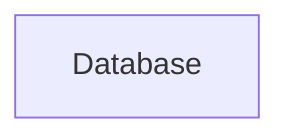

# Food Delivery Application
=========================
## Project Description
The Food Delivery Application is a comprehensive platform designed to facilitate food ordering and delivery services. This application aims to provide a seamless experience for users to browse, order, and receive their favorite food items from various restaurants and shops.

## Features
* User authentication and authorization
* Restaurant and shop management
* Food item management
* Order management
* Real-time updates using Socket.IO
* Recommendation system

## Tech Stack
* Frontend: JavaScript, React
* Backend: Node.js, Express.js
* Database: MongoDB
* APIs: RESTful APIs

## Architecture Overview
```mermaid
graph LR
    A[Client] -->|HTTP Request|> B[Load Balancer]
    B -->|HTTP Request|> C[Server]
    C -->|Database Query|> D[Database]
    D -->|Data|> C
    C -->|HTTP Response|> B
    B -->|HTTP Response|> A
    C -->|Socket.IO|> A
```
The architecture of the Food Delivery Application consists of a client-side application built using React, a server-side application built using Node.js and Express.js, and a database built using MongoDB. The client and server communicate using RESTful APIs, and real-time updates are facilitated using Socket.IO.

## Installation Guide
To install the application, follow these steps:
1. Clone the repository using `git clone https://github.com/username/repository.git`
2. Navigate to the backend directory using `cd Backend`
3. Install dependencies using `npm install`
4. Start the server using `npm start`
5. Navigate to the frontend directory using `cd Frontend`
6. Install dependencies using `npm install`
7. Start the client using `npm start`

## Usage Instructions
To use the application, follow these steps:
1. Open a web browser and navigate to `http://localhost:5173`
2. Register or login to the application
3. Browse restaurants and shops
4. Order food items
5. Receive real-time updates on order status

## API Overview
The application provides the following APIs:
* `POST /auth/register`: Register a new user
* `POST /auth/login`: Login an existing user
* `GET /restaurants`: Get a list of restaurants
* `GET /shops`: Get a list of shops
* `POST /orders`: Place a new order
* `GET /orders`: Get a list of orders

## Folder Structure
The application has the following folder structure:
* `Backend`: Server-side application
	+ `config`: Database configuration
	+ `controllers`: API controllers
	+ `models`: Database models
	+ `routes`: API routes
	+ `services`: Business logic
	+ `utils`: Utility functions
* `Frontend`: Client-side application
	+ `public`: Static assets
	+ `src`: React components

## Deployment Instructions
To deploy the application, follow these steps:
1. Build the frontend using `npm run build`
2. Deploy the backend to a cloud platform such as Vercel or Heroku
3. Deploy the frontend to a cloud platform such as Vercel or Netlify

## Future Improvements
* Implement payment gateway integration
* Improve recommendation system using machine learning algorithms
* Enhance user experience using responsive design and animations
* Implement real-time tracking of delivery personnel
* Improve security using SSL/TLS encryption and secure authentication protocols

## Contributing
To contribute to the application, please follow these steps:
1. Fork the repository using `git fork https://github.com/username/repository.git`
2. Create a new branch using `git branch feature/branch-name`
3. Make changes and commit using `git commit -m "commit message"`
4. Push changes to the remote repository using `git push origin feature/branch-name`
5. Create a pull request to merge changes into the main branch

## Code of Conduct
The Food Delivery Application follows the [Contributor Covenant Code of Conduct](https://www.contributor-covenant.org/version/2/1/code_of_conduct/). Please review the code of conduct before contributing to the application.


# Architecture Documentation


### Application Flow
The application flow can be described as follows:
1. The user interacts with the frontend, which is built using React and is located in the `Frontend` directory.
2. The frontend sends requests to the backend, which is built using Node.js and is located in the `Backend` directory.
3. The backend processes the requests, interacts with the database, and sends responses back to the frontend.
4. The frontend receives the responses and updates the user interface accordingly.
5. The application also uses a machine learning service, located in the `ml-service` directory, to provide food recommendations.

### Backend/Frontend Structure
#### Backend
The backend is built using Node.js and has the following structure:
* `config`: contains configuration files, including database connection settings.
* `controllers`: contains controller functions that handle requests and send responses.
* `middlewares`: contains middleware functions that perform tasks such as authentication and authorization.
* `models`: contains database models that define the structure of the data.
* `routes`: contains route handlers that map URLs to controller functions.
* `services`: contains service functions that perform tasks such as sending emails and processing payments.
* `utils`: contains utility functions that perform tasks such as data validation and encryption.

#### Frontend
The frontend is built using React and has the following structure:
* `components`: contains reusable React components.
* `hooks`: contains custom React hooks.
* `lib`: contains library functions that perform tasks such as data formatting and validation.
* `pages`: contains page components that render the user interface.
* `redux`: contains Redux state management code.
* `services`: contains service functions that perform tasks such as making API requests.
* `utils`: contains utility functions that perform tasks such as data validation and encryption.

### Services
The application uses the following services:
* **Machine Learning Service**: provides food recommendations using a trained model.
* **Email Service**: sends emails to users, such as password reset emails and order confirmations.
* **Payment Service**: processes payments and handles payment-related tasks.

### Deployment Flow
The deployment flow can be described as follows:
1. The frontend is built and deployed to a hosting platform such as Vercel.
2. The backend is built and deployed to a hosting platform such as Heroku.
3. The machine learning service is built and deployed to a hosting platform such as AWS SageMaker.
4. The application is configured to use environment variables and secrets to store sensitive data.

### Scaling Strategy
The scaling strategy can be described as follows:
1. **Horizontal Scaling**: the application is designed to scale horizontally by adding more instances of the backend and frontend.
2. **Vertical Scaling**: the application is designed to scale vertically by increasing the resources allocated to each instance.
3. **Load Balancing**: the application uses load balancing to distribute traffic across multiple instances.
4. **Caching**: the application uses caching to reduce the load on the database and improve performance.

### Mermaid Diagrams
```mermaid
graph LR
    A[User] -->|Interacts with|> B(Frontend)
    B -->|Sends request to|> C(Backend)
    C -->|Processes request|> D(Database)
    D -->|Returns data|> C
    C -->|Returns response|> B
    B -->|Updates UI|> A
```

```mermaid
graph LR
    A[Backend] -->|Uses|> B(Database)
    A -->|Uses|> C(Machine Learning Service)
    A -->|Uses|> D(Email Service)
    A -->|Uses|> E(Payment Service)
```

```mermaid
graph LR
    A[Frontend] -->|Built with|> B(React)
    A -->|Deployed to|> C(Vercel)
    B[Backend] -->|Built with|> D(Node.js)
    B -->|Deployed to|> E(Heroku)
    C[Machine Learning Service] -->|Built with|> F(Python)
    C -->|Deployed to|> G(AWS SageMaker)
```


# Architecture Diagram


