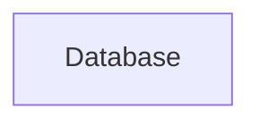

# Food Delivery Application
========================
## Project Description
The Food Delivery Application is a comprehensive platform designed to facilitate food ordering and delivery services. This application aims to provide a seamless experience for users to browse, order, and receive their favorite food items from various restaurants and shops.

## Features
* User authentication and authorization
* Restaurant and shop management
* Food item management
* Order management
* Real-time updates using Socket.IO
* Recommendation system

## Tech Stack
* Frontend: JavaScript, React
* Backend: Node.js, Express.js
* Database: MongoDB
* APIs: RESTful APIs

## Architecture Overview
```mermaid
graph LR
    A[Client] -->|HTTP Request|> B[Load Balancer]
    B -->|HTTP Request|> C[Server]
    C -->|Database Query|> D[Database]
    D -->|Data|> C
    C -->|HTTP Response|> B
    B -->|HTTP Response|> A
    C -->|Socket.IO|> A
```
The architecture of the Food Delivery Application consists of a client-side application built using React, a server-side application built using Node.js and Express.js, and a database built using MongoDB. The client and server communicate using RESTful APIs, and real-time updates are facilitated using Socket.IO.

## Installation Guide
To install the application, follow these steps:
1. Clone the repository using `git clone https://github.com/username/repository.git`
2. Navigate to the backend directory using `cd Backend`
3. Install dependencies using `npm install`
4. Start the server using `npm start`
5. Navigate to the frontend directory using `cd Frontend`
6. Install dependencies using `npm install`
7. Start the client using `npm start`

## Usage Instructions
To use the application, follow these steps:
1. Open a web browser and navigate to `http://localhost:5173`
2. Register or login to the application
3. Browse through the available restaurants and shops
4. Select your desired food items and place an order
5. Track the status of your order in real-time

## API Overview
The application provides RESTful APIs for the following endpoints:
* User authentication: `/api/auth`
* Restaurant management: `/api/restaurants`
* Shop management: `/api/shops`
* Food item management: `/api/food-items`
* Order management: `/api/orders`
* Recommendation system: `/api/recommendations`

## Folder Structure
The application is organized into the following folders:
* `Backend`: Server-side application built using Node.js and Express.js
* `Frontend`: Client-side application built using React
* `config`: Configuration files for the application
* `controllers`: Controller files for the application
* `models`: Model files for the application
* `routes`: Route files for the application
* `services`: Service files for the application
* `utils`: Utility files for the application

## Deployment Instructions
To deploy the application, follow these steps:
1. Set up a production environment using a cloud platform such as AWS or Google Cloud
2. Configure the database and API endpoints for the production environment
3. Deploy the backend and frontend applications to the production environment
4. Configure the load balancer and Socket.IO for real-time updates

## Future Improvements
The following features are planned for future development:
* Integration with payment gateways for secure transactions
* Implementation of a rating and review system for restaurants and shops
* Development of a mobile application for the Food Delivery Application
* Integration with social media platforms for user authentication and sharing
* Implementation of a machine learning-based recommendation system for personalized suggestions.


# Architecture Documentation


### Application Flow
The application flow can be described as follows:
1. The user interacts with the frontend, which is built using React and is located in the `Frontend` directory.
2. The frontend sends requests to the backend, which is built using Node.js and is located in the `Backend` directory.
3. The backend processes the requests, interacts with the database, and sends responses back to the frontend.
4. The frontend receives the responses and updates the user interface accordingly.
5. The application also uses a machine learning service, located in the `ml-service` directory, to provide recommendations to the user.

### Backend/Frontend Structure
The backend is structured into the following directories:
* `config`: contains configuration files, such as database connections.
* `controllers`: contains controllers that handle requests and send responses.
* `middlewares`: contains middleware functions that are executed before or after controllers.
* `models`: contains database models that define the structure of the data.
* `routes`: contains route handlers that map URLs to controllers.
* `services`: contains services that provide additional functionality, such as recommendation services.
* `utils`: contains utility functions that are used throughout the backend.

The frontend is structured into the following directories:
* `components`: contains reusable React components.
* `hooks`: contains custom React hooks that provide additional functionality.
* `lib`: contains library functions that are used throughout the frontend.
* `pages`: contains page-level components that define the user interface.
* `redux`: contains Redux state management code.
* `services`: contains services that provide additional functionality, such as API calls.
* `utils`: contains utility functions that are used throughout the frontend.

### Services
The application uses the following services:
* **Recommendation Service**: provides recommendations to the user based on their preferences.
* **API Service**: provides a interface to interact with the backend.
* **Authentication Service**: handles user authentication and authorization.

### Deployment Flow
The deployment flow can be described as follows:
1. The backend is deployed to a server, such as a cloud provider or a containerization platform.
2. The frontend is deployed to a CDN or a web server.
3. The machine learning service is deployed to a separate server or container.
4. The application is configured to use environment variables or configuration files to connect to the backend and machine learning service.

### Scaling Strategy
The scaling strategy can be described as follows:
1. **Horizontal Scaling**: the application can be scaled horizontally by adding more instances of the backend and machine learning service.
2. **Vertical Scaling**: the application can be scaled vertically by increasing the resources (such as CPU and memory) of the backend and machine learning service instances.
3. **Load Balancing**: the application can use load balancing to distribute traffic across multiple instances of the backend and machine learning service.
4. **Caching**: the application can use caching to reduce the load on the backend and machine learning service.

### Mermaid Diagrams
```mermaid
graph LR
    A[User] -->|Interacts with|> B[Frontend]
    B -->|Sends request to|> C[Backend]
    C -->|Processes request|> D[Database]
    D -->|Returns data|> C
    C -->|Returns response|> B
    B -->|Updates UI|> A
```

```mermaid
graph LR
    A[Frontend] -->|Uses|> B[Components]
    B -->|Uses|> C[Hooks]
    C -->|Uses|> D[Lib]
    D -->|Uses|> E[Pages]
    E -->|Uses|> F[Redux]
    F -->|Uses|> G[Services]
    G -->|Uses|> H[Utils]
```

```mermaid
graph LR
    A[Backend] -->|Uses|> B[Config]
    B -->|Uses|> C[Controllers]
    C -->|Uses|> D[Middlewares]
    D -->|Uses|> E[Models]
    E -->|Uses|> F[Routes]
    F -->|Uses|> G[Services]
    G -->|Uses|> H[Utils]
```

```mermaid
graph LR
    A[Machine Learning Service] -->|Provides|> B[Recommendations]
    B -->|To|> C[Frontend]
    C -->|Uses|> D[API Service]
    D -->|To|> E[Backend]
    E -->|Processes|> F[Request]
    F -->|Returns|> G[Response]
    G -->|To|> C
```

```mermaid
graph LR
    A[Deployment] -->|Deploys|> B[Backend]
    B -->|Deploys|> C[Frontend]
    C -->|Deploys|> D[Machine Learning Service]
    D -->|Configures|> E[Environment Variables]
    E -->|Configures|> F[Configuration Files]
```

```mermaid
graph LR
    A[Scaling] -->|Scales|> B[Horizontally]
    B -->|Scales|> C[Vertically]
    C -->|Uses|> D[Load Balancing]
    D -->|Uses|> E[Caching]
```


# Architecture Diagram


